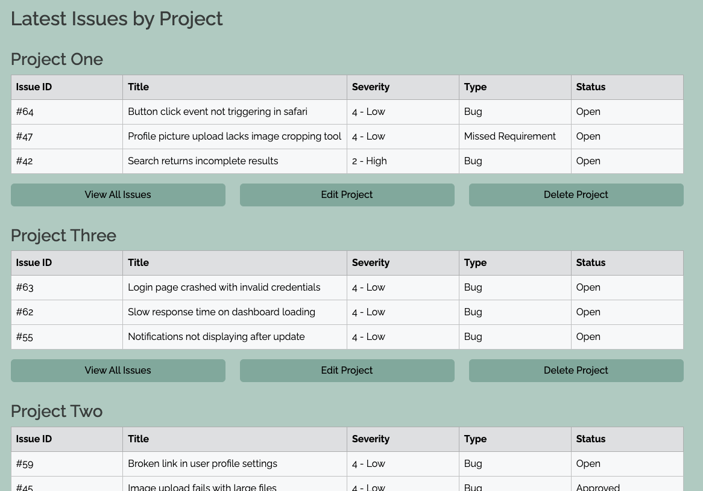
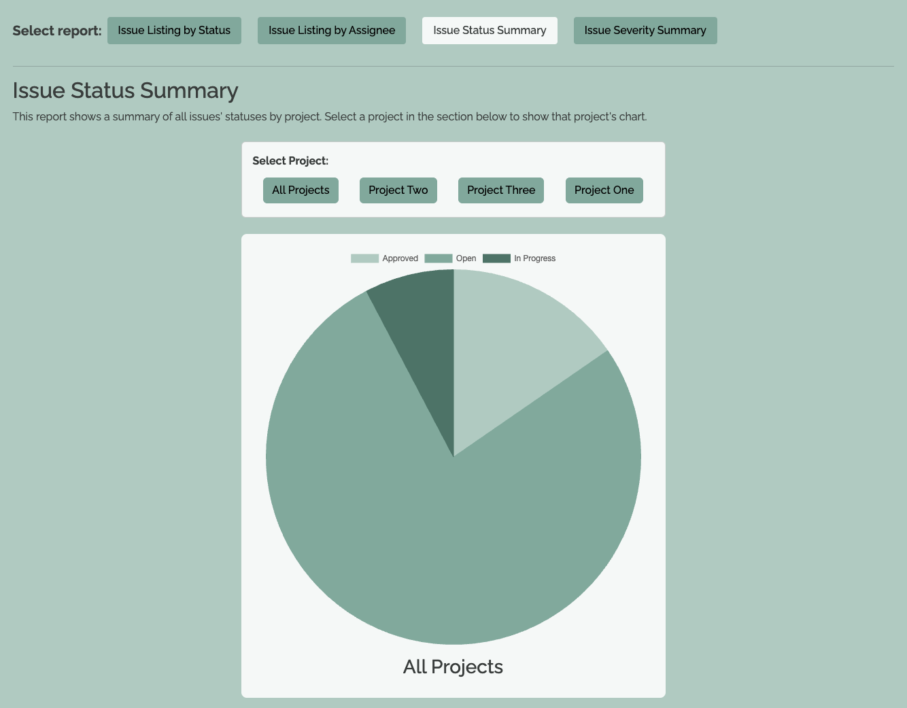
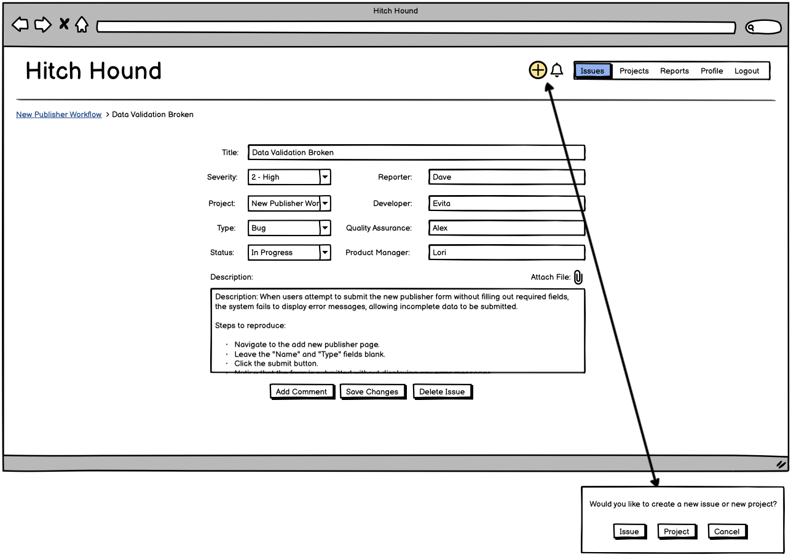
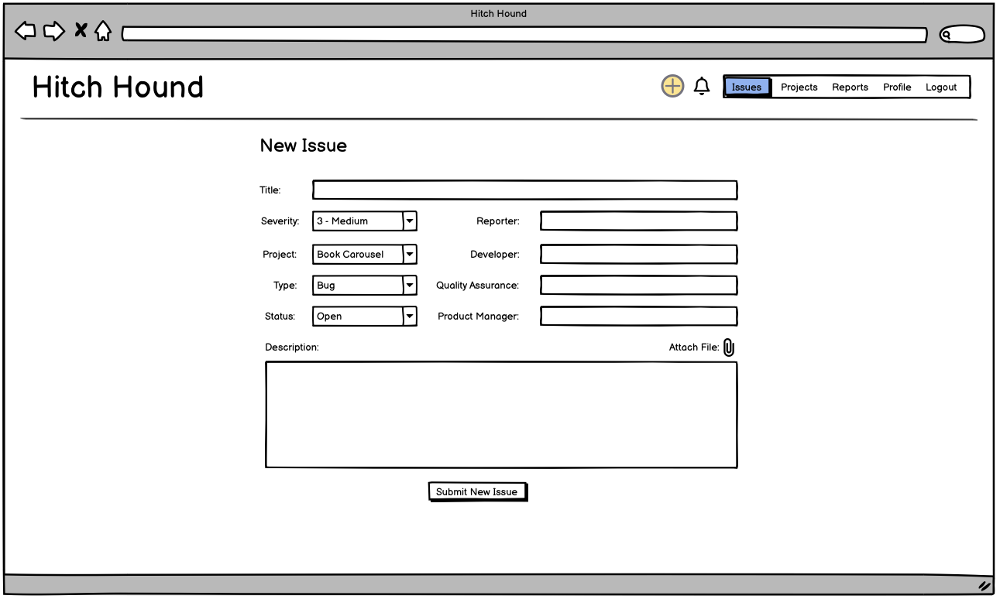
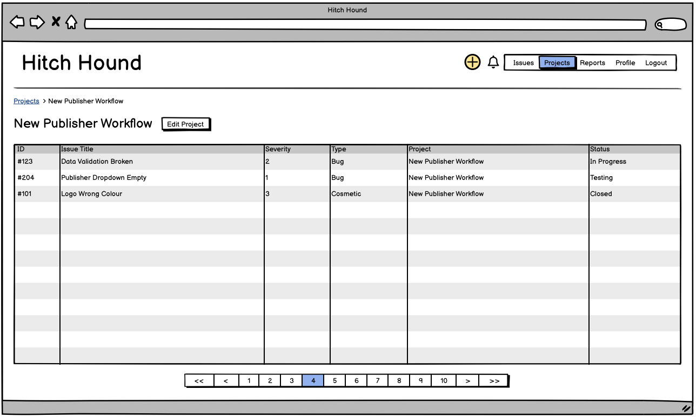
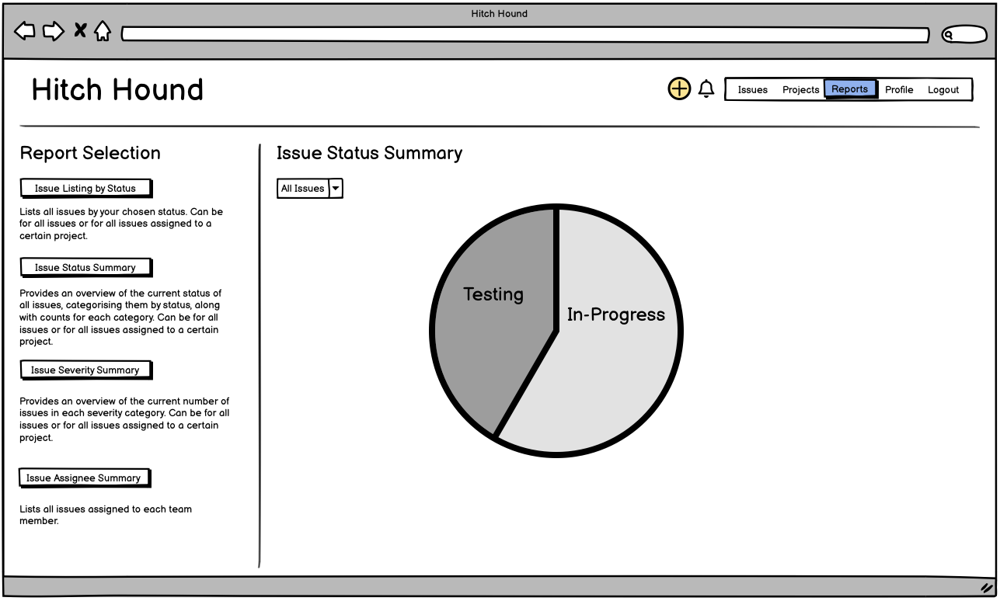
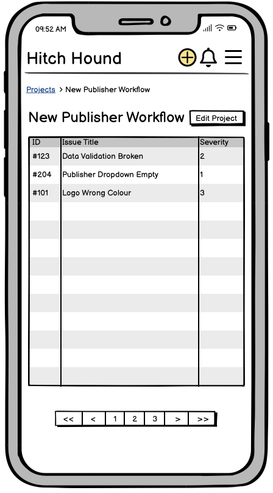
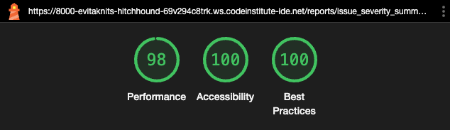

# Hitch Hound: a lightweight issue-tracker

'Hitch Hound' is built using Django, Python, Bootstrap, JavaScript and PostgreSQL. It is hosted on Heroku.
Automated testing is done with Unittest for Python.

To visit the deployed version of Hitch Hound [click here](https://hitchhound-15272de0eee9.herokuapp.com/).

## Table of Contents
1. [Purpose](#1-purpose) 
2. [Features](#2-features) 
3. [Requirement Gathering and Planning](#3-requirement-gathering-and-planning) 
    - [Brief Competitor Analysis and Target Demographic](#brief-competitor-analysis-and-target-demographic) 
    - [Data and Security features](#data-and-security-features)
    - [Epics and User Stories](#epics-and-user-stories) 
    - [User Journeys](#user-journeys) 
    - [User Permissions](#user-permissions)
4. [Data Design](#4-data) 
    -  [Database Schema](#database-schema) 
    -  [Data Manipulation](#data-manipulation) 
    -  [Data Validation](#data-validation) 
5. [User Interface Design](#5-user-interface-design) 
    -  [Computer Wireframes](#computer-wireframes)
    -  [Mobile Wireframes](#mobile-wireframes)
    -  [Colour Scheme](#colour-scheme) 
    -  [Icons](#icons) 
6. [Testing](#6-testing) 
    -  [Continuous Testing](#continuous-testing) 
    -  [Automated Testing](#automated-testing)
    -  [Manual Testing](#manual-testing)
    -  [Browser Compatibility and Screen Size Responsiveness](#browser-compatibility-and-screen-size-responsiveness)
    -  [Code Validation](#code-validation)
    -  [Accessibility](#accessibility)
7. [Bugs](#7-bugs)
8. [Deployment](#8-deployment)
9. [Agile Methodology](#9-agile-methodology)
    -  [Sprint One](#sprint-one-2705-to-0206)
    -  [Sprint Two](#sprint-two-0306-to-0906)
    -  [Sprint Three](#sprint-three-1006-to-1606)
    -  [Sprint Four](#sprint-four-2606-to-0207)
    -  [Sprint Five](#sprint-five-0307-to-0907)
    -  [Sprint Six](#sprint-six-1007-to-1607)
10. [Future Development](#10-future-development)
11. [Credits](#11-credits)

## 1. Purpose
The objective of this program is to streamline the process of tracking and communicating about issues and bugs arising in software development projects. It is lightweight and intuitive, providing ample functionality for small to medium enterprises who don't need an elevated level of auditing and oversight. 

## 2. Features

 - **HEADER**
 The header is present on every page and allows easy and intuitive access to all areas of the site. The logo will always return the user to the home page. The navigation bar allows the user to navigate to the different sections of the site. The + icon allows the user to create a new issue or project and the notification bell 'lights up' yellow when the user has new notifications. Clicking the notifications bell takes the user to their list of notifications. 

    

- **ISSUES**
    - **Issue Listing**: this is the home page and lists all issues on the site, regardless of project or person. This gives a holistic view for all users, of the issues currently in play and the table allows each user to sort the issues by whichever factor is most relevant to their needs at any given time. They simply click on the arrows to sort in ascending or descending order in the table header. The default sorting is in descending order of when the issues were last edited or created. 

    

    - **Issue Detail**: this page shows all the detail of each issue individually and is where the user can edit the information, delete the issue and access the change history for this particular issue. It is also possible to add a comment to the issue which is then displayed in a thread below. This allows users to work on, update and communicate about the issue until it is resolved, when it can be set to closed. 

    **Issue**
    

    **Edit Issue**
    

    **Change History**
    

    **Comments**
    

- **PROJECTS**
    - **Project Listing**: this shows a list of all projects in the system with the latest three issues assigned to them. This provides an overview of all projects for those that want to see which issues are most recent across all projects the team are working on. It also allows those working on a particular project to click through to a list of issues applicable only to that project. The project can also be edited or deleted from here. 

    **Projects**
    

    **Edit Project**
    

    - **Individual Project Page**: this page shows all the issues assigned to a particular project and allows the user to click any issue to navigate to the issue detail page of that issue. It is fully sortable by each field in the same way as the main issue listing page. 

    

 - **REPORTS**
    - **Issue Listing By Status**: this report displays issues by any combination of statuses and projects in the tabular view found elsewhere on the site. The user can select their filters and they will be automatically applied to the table.

    

    - **Issue Listing by Assignee**: this report displays issues by assignees in the tabular view found elsewhere on the site. The user can select their filters and they will be automatically applied to the table.

    
    
    - **Issue Status Summary**: this report shows a summary of all issues' statuses by project in a pie chart format. The user can select a project to show that project's chart.

    

    - **Issue Severity Summary**: this report shows a summary of all issues' severity by project in a pie chart format. The user can select a project to show that project's chart.

    

 - **PROFILE**
 The profile page allows the user to change their name and email address, it also shows their role and advises that they should contact an admin if they want to change it. They can change their password from this screen and view all the issues they reported and are assigned to. This provides a one stop view of the system from the perspective of the individual user, preventing the need to trawl the site to find things relevant to themselves.
 
    

- **NOTIFICATIONS**
The notifications list informs each user of any changes made to the issues that they've either reported or are assigned to. This keeps the entire team informed on all changes and developments. A yellow bell indicates to the user when a new notification is available. This icon reverts to its original colour when all notifications have already been viewed. 

    

## 3. Requirement Gathering and Planning

Before starting the coding for this project, I created a detailed plan including my database schema, user journeys and wireframes.

### Brief Competitor Analysis and Target Demographic
When considering competitors in the realm of issue and bug tracking software, it's helpful to look at some well-known options:

- Atlassian's Jira is widely recognised for its range of features and flexibility, making it a go-to choice for companies of all sizes. 
- Another popular option is GitHub's issue tracking system, which seamlessly integrates with its version control platform, making it a convenient choice for teams already using GitHub. 
- Additionally, tools like Trello are valued for their user-friendly interface and adaptability, though they do lack some of the specific features tailored for issue tracking. 

In this landscape, my program intends to stand out by focusing on simplicity and ease of use, making it ideal for small to medium enterprises (SMEs) looking for a straightforward solution without unnecessary complexity. The goal is to provide a practical and efficient tool for managing software development issues, offering a simpler alternative in a market dominated by larger, more complex platforms.

### Data and Security Features

With this in mind, the data features chosen are clean and simple. Users can create issues that they associate with a particular project. This allows for a streamlined and intuitive user experience, enhancing productivity and facilitating effective project management. 

The security features cover the essentials: authentication with a username and password, data validation and sanitisation, and keeping track of any changes made with an audit trail.

### Epics and User Stories

My user stories can be seen in full in the associated GitHub Project on my repo. This is where all the details, including tasks and acceptance criteria can be seen. These user stories have been assigned to Epics.

| Epic | Stories |
|---| ---|
| 1. User Management | Create basic front-end |
| | User Registration |
| | User Login and Logout |
| | Password Reset |
| | Create and Edit Role-Based Permissions |
| | View and Assign Superuser Status to Users |
| 2. Issue Management | Create Issue |
| | Edit Issue |
| | View Issues |
| | Close, Cancel or Delete Issues |
| | Comment on Issues |
| | Attach Files to Issues |
| 3. Notifications and Error Messaging | Add Meaningful 404 Page |
| | Receive Notifications from Other Users' Actions |
| 4. Enhanced Issue Management | Provide a Change History Log |
| | Connect 2+ Issues as Related |
| |Search for Issues by Keyword |
| 5. Project Management | Create Project |
| | Edit Project |
| | Delete Projects |
| 6. Reporting | Add Reporting |
 
### User Journeys

As a lightweight issue tracking program, my goal was to make each user journey as simple as possible with the fewest steps, whilst still providing value and flexibility of working method. There are ten core user journeys. The below is not an exhaustive list of all possible user journeys, just the most important ones:

1. New User

2. Create an Issue

3. Browse Issues

4. Edit an Issue

5. Close, Cancel or Delete an Issue

6. Create a Project

7. Browse Projects

8. Edit a Project

9. Delete a Project

10. Generate Reports

### User Permissions

There are four types of user, each with different permissions.

| Type | Can create issue? | Can change status to | Can close issue?| Can access admin panel? |
|---|---|---|---|---|
| **Role Based** |
| --> Developer | Yes | In-Progress | No | No |
| --> Quality Assurance | Yes | Testing | No | No |
| --> Product Manager | Yes | Approved |Yes | No |
| **Secondary** |
| --> Superuser | Yes | Any | Yes | Yes |

Each user *must* be assigned a role-based type and *may* also be assigned the superuser type additionally. 

## 4. Data Design

### Database Schema 

**Pre-programming**

I constructed an Entity Relationship Diagram before starting my project to define the key entities and relationships in Hitch Hound, centering Issues and their relationships to all other entities. This is what it looked like: 

**An addition mid-development**
A 'Project ID' to be the primary key for the Projects table. This was required because at the time of designing my database, I didn't realise that it is not possible to edit a primary key. Therefore the title could not be the primary key because the title needs to be editable by users. 

**Post-programming**

At the end of the project, I realised that my diagram was not entirely accurate anymore and that I had implemented things slightly differently, as well as making some additions. I therefore created another Entity Relationship Diagram that accurately represents the end result: 

A couple of notes: 
- The user model inherits from the Abstract User built into Django which provides fields such as first name, last name and username. I have therefore only shown the fields I have extended it with or amended in this diagram.
- In constructing this second ERD, I realised that my initial belief that I required a bridging 'User Issue' table between the 'User' and 'Issue' tables due to the many-to-many relationship between users and issues, may not have been correct. I've ended up only using the 'User Issue' table to power notifications in the system which could potentially have been driven by the 'User' and 'Issue' tables instead. 

### Data Manipulation

Hitch Hound uses CRUD principles to guide all data manipulation. 

**Issues**
- Create: report a new issue, filling in all mandatory fields.
- Read: retrieve an issue by project, issues page, reports or user profile.
- Update: edit an issue's fields or add a new comment. 
- Delete: delete an issue.

**Projects**
- Create: start a new project, filling in the title. 
- Read: retrieve a project via the projects page.
- Update: change the title of a project. 
- Delete: delete a project and all of its issues. 

**Other Data**
- The 'Change' entity type is a type of metadata created after an 'Issue' entity is updated in any way. It is not possible to update or delete a 'Change' entity.
- The 'Comment' entity type is simply one of the updates to the 'Issue' entity type.

### Data Validation

Data validation rules ensure the accuracy and reliability of information stored in the system, ensuring all entries adhere to expected formats. Below, I have detailed the requirements either defined in my models, required by my forms or as they stand in the Abstract User model inherited from Django:

**Users**
- User ID: Must be a unique integer
- First Name: Must be a non-empty string (max-length 150 characters)
- Last Name: Must be a non-empty string (max-length 150 characters)
- Email Address: Must be a valid email format and unique within the system
- Password: Must meet validity requirements set out by Django's built-in password validators, quoted below [from the source](https://docs.djangoproject.com/en/5.0/topics/auth/passwords/#using-built-in-validators).
    - UserAttributeSimilarityValidator, which checks the similarity between the password and a set of attributes of the user.
    - MinimumLengthValidator, which checks whether the password meets a minimum length. This validator is configured with a custom option: it now requires the minimum length to be nine characters, instead of the default eight.
    - CommonPasswordValidator, which checks whether the password occurs in a list of common passwords. By default, it compares to an included list of 20,000 common passwords.
    - NumericPasswordValidator, which checks whether the password isn’t entirely numeric.
- Role: Must be one of the predefined roles (developer, quality assurance or product manager)
- Superuser: Must be a boolean value
- Last Visited Notifications: Datetime that may be empty (until first value is added)

**Projects**
- Project ID: Must be a unique integer
- Title: Must be a unique, non-empty string (max-length 255 characters)

**Issues**
- Issue ID: Must be a unique integer
- Title: Must be a non-empty string (max-length 255 characters)
- Description: Text field (mandatory in Issue forms)
- Severity: Must be one of the predefined levels (4-low, 3-medium, 2-high, 1-critical)
- Project ID: Must reference a valid project ID
- Type: Must be one of the predefined types (bug, missed requirement or other issue)
- Status: Must be one of the predefined statuses (open, in progress, testing, approved, closed or cancelled)
- Reporter: Must reference a valid user ID
- Developer: Must reference a valid user ID
- Quality Assurance: Must reference a valid user ID
- Product Manager: Must reference a valid user ID
- Created At: Mandatory and automatically added datetime.
- Updated By: Must reference a valid user ID

**Comments**
- Comment ID: Must be a unique integer
- Comment Text: Text field (mandatory in Comment form)
- User ID: Must reference a valid user ID
- Issue ID: Must reference a valid issue ID
- Commented At: Mandatory and automatically added datetime.

**Changes**
- Change ID: Must be a unique integer
- Issue ID: Must reference a valid issue ID
- User ID: Must reference a valid user ID
- Changed At: Mandatory and automatically added datetime.
- Field Changed: Must be one of the predefined types (all 'Issue' attributes apart from Issue ID, Reporter, Created At or Updated By).
- Old Value: Text field, can be empty.
- New Value: Text field, can be empty.

## 5. User Interface Design

### Computer Wireframes 

The wireframes I created illustrate the core user interface and functionality of Hitch Hound from both a desktop/laptop perspective and a mobile/tablet perspective. These visual guides serve as a blueprint for the design and structure of the application, ensuring a cohesive and intuitive user experience. 

**Home: Sign Up**

**Home: Log In**

**Home: Logged In**

**Individual Issue**

**Issue Change History**

**New Issue**

**Projects**

**Individual Project**

**New Project**

**Edit Project**

**Reports**

**User Profile**

**Notification Modal**

**404 Page**

### Mobile Wireframes

| **Sign Up** | **Log In** |
|---|---|
| |  |

| **All Issues** | **Individual Issue** |
|---|---|
|| |

|**Issue Change History**| **New Issue** |
|---|---|
| |  |

| **Projects** | **Individual Projects** |
|---|---|
| |  |

| **New Project** | **Edit Project** |
|---|---|
| |  |

| **Reports** |
|---|
|  | 

| **User Profile** | **Notifications** |
|---|---|
||  |

| **404 Page** |
|---|
|  |

### Colour Scheme 

I wanted to pick a muted palette to reflect the business nature of my program. I chose my base colour and then selected two lighter shades to implement as a gradient. I then desaturated my base colour by 90% to find a complementary charcoal grey. Finally, I lightened my colour by 95% to find a complementary cream colour. 

### Icons

As I had chosen the name 'Hitch Hound' for my program, I found these dog themed icons to use: 

| Logo | Favicon |
|---|---|
| |  |

## 6. Testing

### Continuous Testing

Through a combination of automated testing written using Unittest for Python, and manual testing from the front-end, I achieved a good coverage of test cases. The code I wrote was also passed through validators/linters at the end to ensure adherence to coding standards and best practices, ultimately aiming for robust and maintainable code. I considered using Jest to test my JavaScript files but on balance decided that it was not worth doing because the amount of JavaScript was quite small and the functions quite simple. I will be completing a fifth project with advanced front-end frameworks such as React which is better suited to Jest testing, so I will apply it more valuably there. 

### Automated Testing
When I was sufficiently through my project to have a stable enough codebase, I started adding automated tests incrementally for each area. The tests for views, forms and models were added to each app. I carried them out throughout development and also at the very end. I have recorded the outcomes at the end in the table below.

**The Issues App**

| Test Elements | The Test | The Outcome |
|--|--|--|
| Forms | Filling out the Issue form with valid data | Pass |
| | Filling out the Issue form with no data | Pass |
| | Filling out the Issue form with some required fields missing | Pass |
| | Filling out the Issue form with invalid choices for some fields | Pass |
| | Filling out the Comment form with valid data | Pass |
| | Submitting the Comment form with no data | Pass |
| Models | Creating an Issue instance with valid data | Pass |
| | Creating an Issue instance with the default values | Pass |
| | Creating an Issue instance with a missing required field | Pass |
| | Checking the maximum length of the title field | Pass |
| | Ensuring the cascading deletion of related objects: deleting an Issue should delete related Comments | Pass |
| | Ensuring the permission system for updating the status of an Issue is adhered to | Pass |
| | Testing the custom save method for permissions when updating the status of an Issue | Pass |
| | Checking that the Comment text field cannot be blank | Pass |
| | Testing that the __str__ method of the Comment model returns the first 20 characters of the Comment text | Pass |
| Views | Testing the home page/ list all issues view | Pass |
| | Sorting Issues in the list all issues view | Pass |
| | Testing the issue detail view | Pass |
| | Testing the GET request on the Create Issue view | Pass |
| | Testing the POST request on the Create Issue view | Pass |
| | Testing the GET request on the Edit Issue view | Pass |
| | Testing the POST request on the Edit Issue view | Pass |
| | Testing the Delete Issue view | Pass |
| | Testing the Add Comment view | Pass |
| | Testing the Add Comment view with invalid data | Pass | 

**The Notifications App**

| Test Elements | The Test | The Outcome |
|--|--|--|
| Models | Testing that the field choices in the Change model include expected fields | Pass |
| | Testing that the __str__ method of the Change model returns a human-readable string representing the change in the required format | Pass |
| Views | Check that the Last Visited Notifications datetime is updated after the Notifications page is viewed | Pass |
| | Check whether the Notifications list is correctly populated | Pass |
| | Check the Change History view of a specific Issue | Pass |
| | Check the Change History view when there are no changes for a specific Issue | Pass |

**The Projects App**

| Test Elements | The Test | The Outcome |
|--|--|--|
| Forms | Filling out the Project form with valid data | Pass |
| | Submitting the Project form with no data | Pass |
| Models | Creating a Project with a title | Pass |
| | Creating a project without a title | Pass |
| Views | Check the main Project listing view | Pass |
| | Check the specific Project view that lists all Issues for that Project | Pass |
| | Testing the GET request for the Create Project view | Pass |
| | Testing the POST request for the Create Project view | Pass |
| | Testing the GET request for the Edit Project view | Pass |
| | Testing the POST request for the Edit Project view | Pass |
| | Testing the POST request for deleting a Project | Pass |

**The Reporting App**

| Test Elements | The Test | The Outcome |
|--|--|--|
| Views | Check the Issue Listing by Status report view returns the correct template and context data | Pass |
| | Check the Issue Listing by Assignee report view returns the correct template and context data | Pass |
| | Check the Issue Status Summary report view returns the correct template and context data | Pass |
| | Check the Issue Severity Summary report view returns the correct template and context data | Pass |

**The Users App**

| Test Elements | The Test | The Outcome |
|--|--|--|
| Forms | Filling out the User Creation form with valid data | Pass |
| | Filling out the User Creation form with no data | Pass |
| | Filling out the User Creation form with some required fields missing | Pass |
| | Filling out the User Creation form with mismatched passwords | Pass |
| | Filling out the User Creation form with an invalid email address | Pass |
| | Testing the user is created via the signup view | Pass |
| | Testing the User Profile form with valid data | Pass |
| | Testing the User Profile form with no data | Pass |
| | Testing the User Profile form with some required fields missing | Pass |
| | Testing the User Profile form with an invalid email address | Pass |
| | Testing updating the User Profile form with valid data | Pass |
| Models | Create a User with a specific role | Pass |
| | Check the __str__ method of the User Model returns the username | Pass |
| | Test that the User Manager model's developers method returns users with the 'developer' role | Pass |
| | Test that the User Manager model's quality assurance method returns users with the 'quality assurance' role | Pass |
| | Test that the User Manager model's product managers method returns users with the 'product manager' role | Pass |
| Views | Test the GET request for the Login view | Pass |
| | Test the POST request for the Login view with valid credentials | Pass |
| | Test the POST request for the Login view with invalid credentials | Pass |
| | Test the GET request for the Sign Up view | Pass |
| | test the POST request for the Sign Up view with valid data | Pass |
| | Test the POST request for the Sign Up view with invalid data | Pass |
| | Test the GET request for the Password Reset view | Pass |
| | Test the POST request for the Password Reset view with a valid email address | Pass |
| | Test a password reset email is sent | Pass |
| | Test the POST request for the Password Reset view with an invalid email address | Pass |
| | Test the GET request for the Password Reset Done view | Pass |
| | Test the GET request for the Password Reset Complete view | Pass |
| | Test the GET request for the User Profile view | Pass |
| | Test the GET request for the Change Password view | Pass |
| | Test the POST request for the Change Password view with valid data | Pass |
| | Test the POST request for the Change Password view with invalid data | Pass |
| | Test the GET request for the User Profile view sorting | Pass |
| | test the GET request for the User Profile view with pagination | Pass |

### Manual Testing

I constantly manually tested my site as I progressed through building it, ensuring each change achieved what I intended.

My manual testing at the end covered: 

- Each user journey from end to end
- The level of access when logged out 
- The level of access when logged in as a regular user
- The level of access when logged in as a superuser

All manual testing was successful and passed. 

### Browser Compatibility and Screen Size Responsiveness

I viewed the site on each of the three key screen sizes (mobile, tablet and computer), using devtools, on four of the most popular browsers. I also used the responsive setting to slide the width of the screen from narrow all the way through to wide to check the transition points. 

Pixel references for each of the screen sizes:

|Screen | Pixels |
|-----|-----|
| Mobile - iPhone SE | 375px |
| Tablet - iPad Mini | 768px |
| Computer | 1366px |

| Browser | Screen Size | Appearance | Responsiveness |
|-------|-----|-----|-----|
| Chrome | Mobile | Bug 19  | Good |
| | Tablet | Bug 19  | Good  |
| | Computer | Good | Good |
| | Transition Points | Good | Good |
| Firefox | Mobile | Bug 19  | Good |
| | Tablet | Bug 19 | Good |
| | Computer | Good | Good |
| | Transition Points | Good | Good |
| Safari | Mobile | Bug 19 | Good  |
| | Tablet | Bug 19 | Good  |
| | Computer |  Good |Good  |
| | Transition Points | Good | Good |
| Edge | Mobile | Bug 19 | Good |
| | Tablet | Bug 19  | Good |
| | Computer | Good | Good |
| | Transition Points | Good | Good |

### Code Validation

| Language | Validation Method | Outcome |
|---|----|----|
| HTML | Via direct input on [W3C HTML Validator](https://validator.w3.org/) | 9 errors across all pages. All resolved.|
| CSS | Via direct input on [W3C CSS Validator](https://jigsaw.w3.org/css-validator/) | No errors found. |
| JavaScript | [JS Hint](https://jshint.com/) | 1 error: missing semicolons. All resolved.  |
| Python | [CI Python Linter](https://pep8ci.herokuapp.com/) | Many errors. All resolved. |

### Accessibility 

**Lighthouse**

To ensure the front end of my program was accessible I used Lighthouse. After my initial rounds of testing, I made changes to the colour of some buttons due to insufficient contrast and added some labels to fields I had missed. This improved accessibility and I have recorded the final results for each page below: 

| Page | Result |
|----|----|
| Login |   |
| Registration |  |
| Forgotten Password |  |
| Issue Listing (home page) |   |
| Issue Detail | |
| Edit Issue |  |
| Change History |   |
| Create Issue |   |
| Create Project |   |
| Project Listing |    |
| Project Detail |   |
| Edit Project |   |
| Profile |     |
| Change Password |   |
| Notifications |   |
| Issue Listing by Status Report |   |
| Issue Listing by Assignee Report |   |
| Issue Status Summary Report |   |
| Issue Severity Summary Report |   |

**Colour Contrast** 

I checked my initial colour palette prior to development but found during my accessibility testing with lighthouse that I had combined colours in a few instances that did not have sufficient contrast. These were changed to meet accessibility standards. 

## 7. Bugs

Here is the list of bugs mostly found towards the end of development when I encountered functionality not working as intended that I had previously thought did. I don't believe I have left any unresolved bugs. 

### Bug One

**Issue**
>About halfway through development, I tried to change the primary key of my 'Project' model from the 'Title' field to a new 'Project ID' field. This was because I had discovered that it is not possible to edit a primary key, so if a user wanted to change the title of their project, they would not be able to do so. Whilst making this change, I also found that Django automatically assigns an auto-incrementing ID to every model you create. I may have learnt this at some point, but because this auto-assignment is implicit and not actually visible in the files I was working on, I did not realise. I had to delete the ID fields from all my models and recreate my database. The issue this ultimately created was that I had been working for quite some time on the original data models and they were intertwined throughout my functionality. Making this change broke a significant portion of my existing functionality. 

**Solution**
>The solution to this was going through systematically, encountering errors and resolving them until all references to IDs had either been removed or switched to the auto-assigned ones in Django. 

### Bug Two

**Issue**
>I noticed that the error message on my login page wasn't working anymore. When incorrect login credentials are entered, the page simply reloads without displaying any error message, leaving the user unaware of why they haven't been logged in. 

**Solution**
>The solution involved modifying the template to properly handle and display error messaging when login credentials are incorrect. I previously had a small bit of Javascript at the bottom of the page to handle this, but as it wasn't working, I changed to using Django templating language in the body of the template and it started working again. See related commit for the code change.

### Bug Three

**Issue**
>Sorting by project or reporter on the Issues Listing page causes a FieldError: "Cannot resolve keyword 'project.title' into field" and "Cannot resolve keyword 'reporter.username' into field." 

**Solution**

>For both of these, I discovered that in Django, you need to use double underscores instead of dots to traverse relationships between models. So because 'Projects' and 'Users' are two separate models from the 'Issue' model which is the main one being used in this table, I needed to use underscores for them, not dots. For example, 'project__title' not 'project.title'.

### Bug Four

**Issue**
>When a large amount of text is added to the Issue Description field, it causes the table on the Issue Detail page to go off the right edge of the page. It also causes there to be a scroll bar on the Change History page.

| | |
| --| --| 
|  |  |

**Solution**
>I added Bootstrap's text wrapping and word break utilities on the offending table columns. This is what they looked like after the change: 

| | |
| --| --| 
|  |  |

### Bug Five

**Issue**
>A separate issue caused by a large amount of text that persisted after the fix for bug four, was the throwing off of the header row on the Change History table. See solution images in bug four above. 

**Solution**
>I added Bootstrap's utility that prevents text wrapping to the whole table heading row. 

### Bug Six

**Issue**
>I noticed that instead of values such as 'In Progress' - I could see values formatted as 'in_progress' on the UI. I took a look at my models and I had ordered my choice sets correctly, with the stored value first, then the display value. So it meant that I was showing the stored database values rather than the corresponding display values. Here, the Severity, Type and Status columns are using the stored values as evidence by the lowercase words and underscores.

**Solution**
>The solution was to go through the site and find all the places I am displaying such fields and ensure I am using the display values. For example, where I had used `issue.status`, I now used `issue.get_status_display`. This ensured all the display values were being shown on the UI. Here is the same table using the display values: 

### Bug Seven

**Issue**
>The sorting by Severity on tables like the Issue Listing page, was not working as expected. The column was being sorted alphabetically rather than by severity. 

**Solution**
>I changed the Issue Model's 'Severity' choices to integers and sorted by those instead of the previous names, so the display names remain in the format '1-Critical' but the stored values are just integers, e.g. 1. This solved the issue and allowed the sorting by severity to be accurate. 

### Bug Eight

**Issue**
>There was an alert on the Password Reset form page indicating the deletion of a project, which is irrelevant to the scenario. 

**Solution**
> I found that I had a block of code implementing alerts on this page. I removed this and that removed the project deletion alert. 

### Bug Nine

**Issue**
>When I finished the main coding of my project and started to go through my files to tidy them all up, I came across my secret ket in my settings file. I had overlooked this throughout development and therefore committed it to GitHub. It was therefore no longer secret. 

**Solution** 
>I used [Djecrety](https://djecrety.ir/) to generate a new secret key, placed this in the env file and hooked it up to the settings. This reinstated this security setting correctly. 

### Bug Ten

**Issue**
>After I had finished going through and adding my docstrings and comments, as well as ensuring consistent quote marks and naming across all files, I had accidentally made changes that meant my pie charts and alerts were no longer displaying. 

**Solution**
>I found that I had used my IDE to do an automatic format (right-click/format document) and that this had thrown the data and labels off in the code snippet below. Restoring them to this state made my pie charts reappear.  

`const labels = {{ labels | safe }};`  

`const data = {{ data | safe }};`

>I also found that I had somehow duplicated the line below in my alerts.js file. Deleting this made my alerts reappear.  

`if (predefinedAlertType) {`

### Bug Eleven

**Issue**
>The user details form on the Profile page is not working as expected: the Cancel button saves the form rather than cancelling any changes. 

**Solution**
>I made a change so that the Cancel button simply refreshes the Profile page, thus effectively removing any changes and setting the form back to non-edit mode. 

### Bug Twelve

**Issue**
>Alerts are erroneously showing up in three different scenarios: 
>1. When a user goes to the 'Change Password' form from the Profile page and clicks the 'Save' button, the 'successfully changed password' alert appears on the next page the user accesses that has an alert placeholder on it, regardless of if they actually changed their password or not. 
>2. When a user uses the 'Create Issue' form without adding all mandatory information and clicks the 'Save' button, receives validation errors, then decides not to create a new issue and cancels, the 'created a new issue' alert appears anyway. 
>3. When a user uses the 'Create Project' form without filling the field in and clicks the 'Save' button, receives a validation error, then decides not to create a new project and cancels, the 'created a new project' alert appears anyway. 

**Solution**
>I found that I had set up the alerts to be triggered when clicking the button, rather than when the new item is actually saved. I removed this behaviour from the buttons and switched to setting the session variable in the view when the new item is saved successfully. This meant that I moved the session variable to the server side and therefore needed to pass it to the client side via the context on each page that displays the alerts. This solved all three scenarios. 

### Bug Thirteen

**Issue**
>I made a change that removed the 'Status' field from the form used to create a new issue. This is because when an issue is created it should automatically be set to 'Open' and not be changeable at this stage. It should however be changeable afterwards, when a user edits an issue. I realised I accidentally removed the 'Status' field from both the create and edit issue forms. 

**Solution**
>As the same form is used for creating and editing issues, I needed to include the 'Status' field conditionally. So I added the 'Status' field back into the list of fields for this form, then made sure it only appears on the edit issue form by checking whether the issue instance already exists or not. If it does not exist already, this means it's a new issue and the status field should not appear, therefore it is removed from the list of fields. 

### Bug Fourteen

**Issue**
>The 404 page shows 'Login' in the navbar rather than the full menu that the user needs to use to navigate away from the 404 page. 

**Solution**
>When I changed the way my navbar was coded in order to remove repetition whilst ensuring the correct version of the navbar is included in each page, I overlooked the 404 page. I just had to add the correct context to the custom_404 view and this reinstated the full navbar. 

### Bug Fifteen

**Issue**
>The Edit Issue page does not show an alert to explain to the user why they cannot change the Status of issues to a particular value. 

**Solution**
>I looked back at the changes I made when I first implemented it and I saw that at some point along the way I had lost the section in my Edit Issue template, which displays the alerts. Adding this back in fixed the issue. I also realised that I had duplicate and redundant code in the 'Change Issue Status' view. It was redundant because I had incorporated the functionality into the main 'Edit Issue' view, so I deleted the other view. Also, related to this bug, I saw that in my message to the user about why they couldn't change the status to a particular value, I was showing the internal status values rather than the intended display values, so I changed this too. 

### Bug Sixteen

**Issue**
>When a user clicks 'Add a Comment' on an Issue Detail page, without entering any text into the box, the page refreshes and the navbar contains only a link to 'Login' despite the user already being logged in and it having no relevance to the task at hand. 

**Solution**
>I made a change so that the 'Add a Comment' button is disabled when there is no text in the comment box. This solves the issue.

### Bug Seventeen

**Issue**
>On the Change History page of an Issue, and on the Issue Status Summary report, I was showing the stored database values rather than the corresponding display values. This is the same type of issue as Bug Six. 

**Solution**
>For the Change History page, this needed a more in-depth solution in my Change model, where I implemented methods to dynamically fetch and show the display values for various fields based on their defined choices. For the Report, I updated the view to map the status values to their display names before passing them to the pie chart so it could display them correctly. 

#### Bug Eighteen

**Issue**
>After deleting a project, an alert appears on the 'Edit Issue' page when the user next accesses it informing them 'Project Deleted Successfully'. Firstly, a similar alert will have been seen on the Projects page when the user is directed back there after project deletion. Secondly, this alert is not relevant to the Edit Issue page.

**Solution**
>I found that I had accidentally left a line of code in my 'Delete Project' view from a previous version of my alerting system that was causing this message to appear. I removed this line and the bug was fixed.

#### Bug Nineteen

**Issue**
>This bug contains all the cosmetic issues found on mobile and tablet screens during browser and responsivity testing: 
>- a. Burger Menu is aligned right and looks odd.
>- b. Buttons on 'Issue Detail' page stuck together on two rows.
>- c. Issue Table header row is split across 2 rows when the title column has an entry longer than 15 characters.
>- d. 'Select a report' is split over 3 lines in the report area and looks untidy.
>- e. 'Edit' and 'Change Password' buttons should be stacked and full width on 'Profile' page when not in edit mode and 'Save Changes' and 'Cancel' buttons should also be stacked and full width when in edit mode, following convention set elsewhere. This should be on mobile screens. 
>- f. All buttons on the 'Edit Issue' page should be full width and stacked on tablets as it already is on mobile screens. 
>- g. On Chrome and Edge only: the dropdowns on forms have tiny text and float away from their field label.
>- h. The pie charts are too small on tablet screens and have a varying amount of padding underneath depending on the various screen sizes. This should be consistent.
>- i. The pie charts sometimes had no padding at the bottom of the screen and other times did have it, depending on screen size. This was despite me not specifying padding my screen size.

**Solution**
>These have all been solved: 
>- a. The burger menu has been changed to an offcanvas navbar using Bootstrap.
>- b. The buttons on 'Issue Detail' pages have been converted to 100% width on mobile screens in the same way that other buttons on different pages were already.
>- c. The title column has been restricted to 15 characters maximum on smaller screens and left at 50 characters on larger screens. Two columns removed from tablet size screens for the Issue table to help with information spacing on this size screen too. 
>- d. This has been renamed 'Select Report'.
>- e. These buttons have all been made full width and stacked on mobile and tablet screens.
>- f. These buttons have all been made full width and stacked on tablet screens. 
>- g. This turned out to be a bug with the Chrome and Edge dev tools mobile emulators. When tested on an actual mobile device, the dropdowns appeared correctly. 
>- h. I changed the Bootstrap column settings to increase their sizes on the medium screens. 
>- i. I added a class to the appropriate container and added 30px of padding at the bottom of the chart regardless of screen size. 

#### Bug Twenty

**Issue**
>It is currently possible to register for an account and use the same email address as an existing user.

**Solution**
>I changed my user model to make sure that email addresses must be unique. 

## 8. Deployment
This project was deployed to [Heroku](https://id.heroku.com/login): a hosting platform. 

1. Create a PostgreSQL Database 
- Create a PostgreSQL database using your preferred provider. As a student of Code Institute, I used their [proprietary offering](https://dbs.ci-dbs.net/).
2. Create a new app on Heroku
- Go to [Heroku](https://id.heroku.com/login) and create a new app.
3. Configure Database
- In the 'Settings' tab of your new app, under 'CONFIG VARS', add a key called `DATABASE_URL` and paste the database URL into the value field. 
4. Clone the repository and connect to Heroku
- Clone this repository from GitHub and go to Heroku to connect it on the 'Deploy' tab of your app.
5. Set up an Email Address for use in the Password Reset process
- Set up an email address with your preferred provider from which to send password reset emails. 
- Generate an app password from this provider. 
6. Create an `env.py` file
- Create an `env.py` file which should be included in your `.gitignore` file, in the root of your project to store your environment variables.
- Add a secret key. I used [Djecrety](https://djecrety.ir/). 
- Add the email address and app password from the previous step here too.
7. Update your `CONFIG VARS` section on Heroku
- Add your secret key.
- Add your email address.
- Add your app password.
8. Configure Django settings
- Update your `settings.py` file to use the environment variables you set up in earlier steps.
- Ensure `DEBUG` is set to `False` for deployment.
- Set `ALLOWED_HOSTS` to include your Heroku app's domain.
- Configure static file handling - I used `whitenoise` for static file management and added it to my 'MIDDLEWARE' settings.
9. Install Dependencies
- Ensure all dependencies are installed by running: `pip install -r requirements.txt`
10. Collect Static files
- Collect the static files in your project using: `python manage.py collectstatic`
11. Add 'python' Buildpack on Heroku
- Go to the 'Settings' tab on Heroku and add the `python` buildpack.
12. Migrate Database 
- Run database migrations in your terminal: `python manage.py migrate`
13. Create a Superuser
- Create a Django superuser for accessing the admin interface: `python manage.py createsuperuser`
14. Deploy the App
- Either enable automatic deploys or click to deploy manually in Heroku's 'Deploy' tab.

## 9. Agile Methodology
I set this project up in GitHub projects using agile methodology. This facilitated my prioritisation and time management. I added all the user stories as issues and then divided them into 'MVP'(Minimum Viable Product) and 'Future Enhancements' to signify what I intend to complete for my assessed project and what could come later. Those MVP stories were then stack-ranked. I added three one-week sprints to start the project and filled my first sprint with my intended work according to the MoSCoW prioritisation system. 

**User Stories Assigned to Epics** 

**An Example User Story** 

### Sprint One: 05/06 to 11/06

**Sprint Planning**
Sprint planning involved taking the highest priority issues from the top of the stack and assigning them to the first sprint. I marked the first three as 'Must Have' for this sprint, the next one 'Should Have' and the last two 'Could Have'. This gave me a breakdown of 50% for must, 16.6% for should and 33.4% for could. If I achieve all of these user stories in the first sprint, I will have completed my first epic: User Management.

**Sprint Retrospective**

Sprint Overview: 
During my initial one-week sprint, I completed the user story for 'Create basic front-end'. This task involved laying much of the foundational work for my project.

Achievements: 
- Successfully created the basic front-end.
- Established the groundwork for future development.

Progress:
- Began working on 'User Registration' user story
- Completed the setup of the database schema and models
- Integrated the database with the project

Challenges: 
- Time constraints were more significant than anticipated, affecting my ability to complete all planned tasks

Action Items for Next Sprint: 
- Improve time estimation, including buffer time for unforeseen challenges
- Aim to complete the first epic

### Sprint Two: 12/06 to 18/06

**Sprint Planning**
For the second sprint, I carried over the same stories I had planned for the first sprint but not finished. I did not include any more because experience has shown me that I am unlikely to get all these stories finished. Therefore only 40% of the stories are must have, 20% should have and 40% could have. With more time this sprint, I should be able to complete the must have stories at a minimum. 

**Sprint Retrospective**
Achievements: 
- Successfully created the user registration, login and logout.

Progress:
- Began working on 'Password Reset' user story
- Continued learning about Django and how to set up different elements

Challenges: 
- Configuration was not as straightforward as I hoped, so there were a couple of times it felt like 2 steps forward, 1 step back. 

Action Items for Next Sprint: 
- Complete the first epic. Just half a user story left.
- Make a good dent in Epic 2: Issue Management.

### Sprint Three: 19/06 to 25/06

**Sprint Planning**
For the third sprint, I carried over one story and put back another story, towards the bottom of the backlog as I realised I would not be able to sort out all the permissions until I had the bulk of the reset of the development complete. 50% of my stories for sprint 3 are must have, 25% should have and 25% could have. If I manage to complete these, I can always pull in some more stories. 

**Sprint Retrospective**
I realised after the sprint had begun, that I needed a user story for creating the user profile page. I'd missed it when initially writing up my user stories. This has a list of issues assigned to the user on it however, so needs to be done later on in the project. I created it and put it further down the backlog. 

I also picked up speed this sprint and completed all four of the planned user stories by the middle of the sprint. I pulled in four more, labelling two of them 'Should Have' and the other two 'Could Have' as I had already met my sprint commitments. 

### Sprint Four: 26/06 to 02/07

**Sprint Planning**
For my fourth sprint, I carried over two of the four I pulled in half way through, and added five more stories for a total of 7. I've got 3 must haves, 2 should haves and 2 could haves. I do have quite a large issue to deal with first but I feel as though I am into the flow of how Django works and what my project should do to be able to work with this split. 

**Sprint Retrospective**
I nearly achieved all of my must haves but had to pause to add automated testing to the whole project so far, as I had not added any up to this point. I was very close to finishing the final must have but I had implemented two independent forms on the same page and they were interfering with each other. I think I'll need to split them up so they can be on different pages and not influence each other as they currently do. I also had to replace my database due to having assigned IDs to my models and not realising that Django does this automatically for you. There were significant delays this sprint. 
 
### Sprint Five: 03/07 to 09/07
 

**Sprint Planning**
I have planned the remainder of my stories into sprint five with 3 must haves, 2 should haves and 2 could haves. If I need a sixth sprint, I will of course carry over any that were not completed this sprint. 

**Sprint Retrospective**
I got through a tremendous amount in this sprint, finishing all but one of my user stories. I could really see how much I had improved from the start of the project as things took me less time to figure out. 

### Sprint Six: 10/07 to 16/07

**Sprint Planning**
I have moved my final story over to this sprint, plus added one more 'Add breadcrumbs' as I realise I need them for effective navigation. I will also be refactoring my code, adding more comments and docstrings, as well as finishing off my README this sprint. The goal is to complete my project by the end of it. As such, both the stories in this sprint have been marked as must haves. 

**Sprint Retrospective**
I finished the reporting feature early in the sprint and moved onto the final story: the breadcrumbs. 

As I was implementing the breadcrumb feature, I thought about the breadcrumbs I actually wanted to implement. All top levels of the breadcrumbs could be accessed via the navigation bar, then all but one of the breacrumbs were just two pages deep. They would be mostly duplicating my existing navbar and therefore be presenting duplicate information on the page. I thought this could be confusing for the user and look messy, so I reverted my changes and decided against breadcrumbs after all. 

During this sprint I also concentrated on getting my project to be as non-repetitive as possible. This involved using the django templating more effectively, now that I understood it better. 

I also did a tidy up which included fixing bugs (see dedicated bug section above) and implementing small bits of functionality that I had missed in my main run through of the project: 

- Making the project field on the issue detail clickable to go to that project. 
- Adding a 'You don't have any issues assigned to you.' message on the Profile page. 
- Adding a 'You don't have any notifications yet.' message on the Notifications page. 
- Removing the role dropdown and making the field read-only on the Profile page. 
- Removing the status field from the Create Issue page and auto-populating this value to 'Open'. 

## 10. Future Development
These three stories were nice to haves if I found I had enough time to implement them. They are under Epic 4: Enhanced Issue Management. In the end, I only had enough time to implement the first story in this epic: 'Provide a Change History Log'. I completed all other stories in all other epics. 

- Attach Files to Issues
- Connect 2+ Issues as Related
- Search for Issues by Keyword

I also looked into the possibility of retaining the formatting and line breaks in the Comments, as my program currently removes them upon saving. However, I decided against making any changes because my research indicated that to preserve formatting and lines breaks, the comment text would need to be rendered as HTML. Django automatically escapes HTML to prevent Cross-Site Scripting attacks as a security measure. I don't want to make changes that override Django's security protocols, especially as I don't believe preservation of formatting justifies compromising security measures. 

## 11. Credits

I referred back to the Code Institute set up videos to remind me how to set up the APIs, credentials and files before starting coding.

- I built my flowcharts using [Mermaid](https://mermaid.js.org/syntax/flowchart.html) in my readme.
- I manipulated my base colour to figure out my colour palette using [MDigi Tools](https://mdigi.tools/desaturate-color/#508072).
- I visually represented my colour palette using [Adobe Colour](https://color.adobe.com/create/color-wheel).
- I sourced my icons from [Font Awesome](https://fontawesome.com/search?q=dog&o=r&m=free)
- I created all my favicons with [Real Favicon Generator](https://realfavicongenerator.net/)
- I used [ChatGPT](https://chatgpt.com) to explain error messages and research the best way to go about my implementation.
- I used [Learn Django](https://learndjango.com/tutorials/django-login-and-logout-tutorial) to help me set up login/logout etc.
- I used [MDN Web Docs](https://developer.mozilla.org/en-US/docs/Learn/Server-side/Django/Testing) to walk me through testing a Django web app.
- The image of the sad pug on the custom 404 page is from [Unsplash](https://unsplash.com/photos/fawn-pug-lying-on-floor-6x-hVXXiBxs).
- I generated a new secret key using [Djecrety](https://djecrety.ir/).

I also used the documentation of all the elements included in this project: 
- [Django](https://docs.djangoproject.com/en/4.2/)
- [Bootstrap](https://getbootstrap.com/docs/4.1/getting-started/introduction/)
- [PostgreSQL](https://www.postgresql.org/docs/current/)

**General Credit**
As ever, I want to thank the open source community for the great resources that teach me so much and also remind me of what I learnt in my Code Institute lessons. 

I believe I have credited where I used specific items in the previous section but this is a general credit to the reference resources I looked through to teach me new elements as well as reminding me how things I'd already come across worked as I went along. 

Every effort has been made to credit everything used, but if I find anything else specific later on that needs crediting, that I missed, I will be sure to add it.
