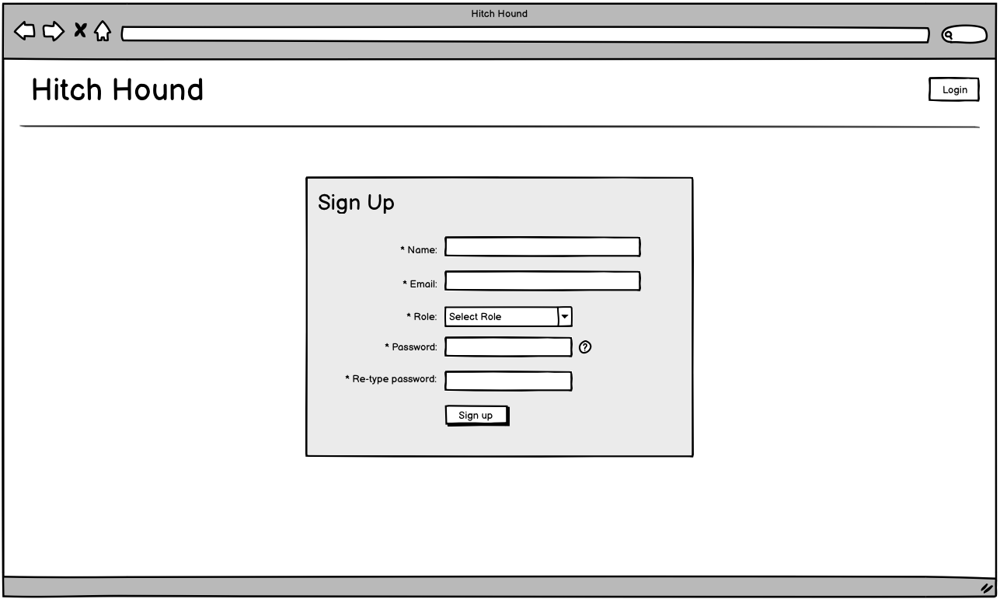
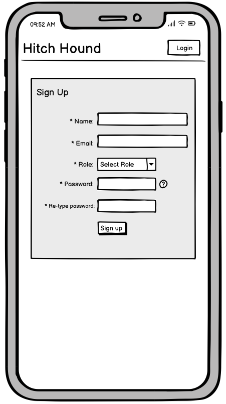
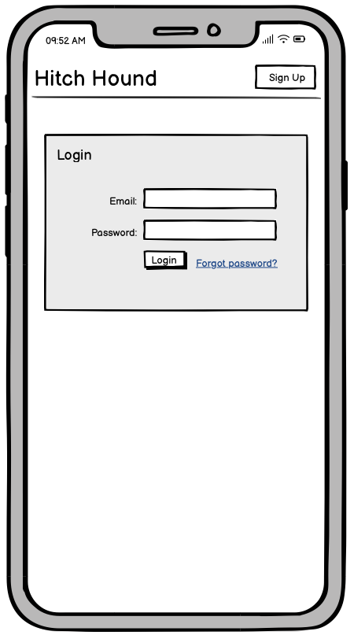
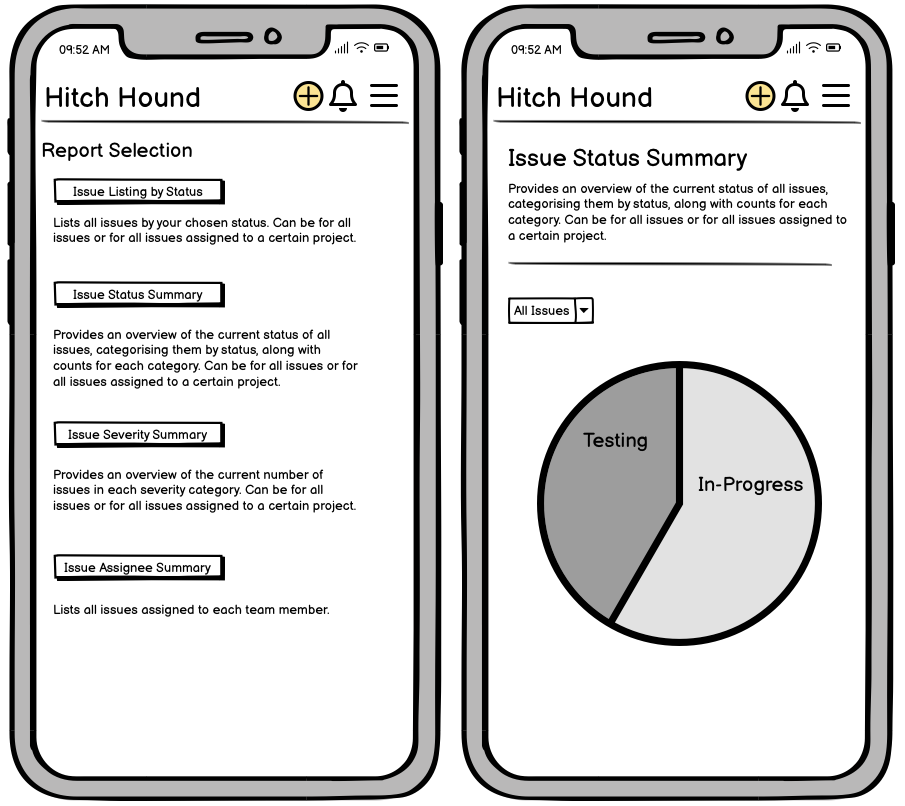
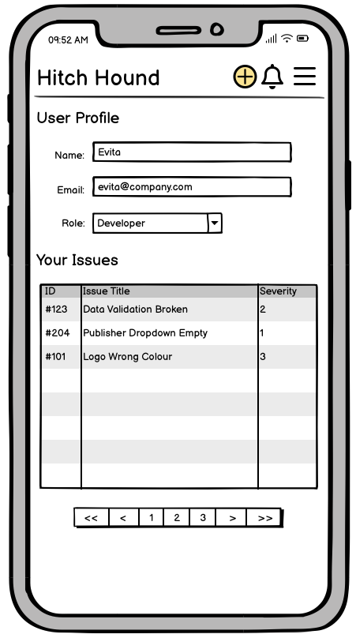
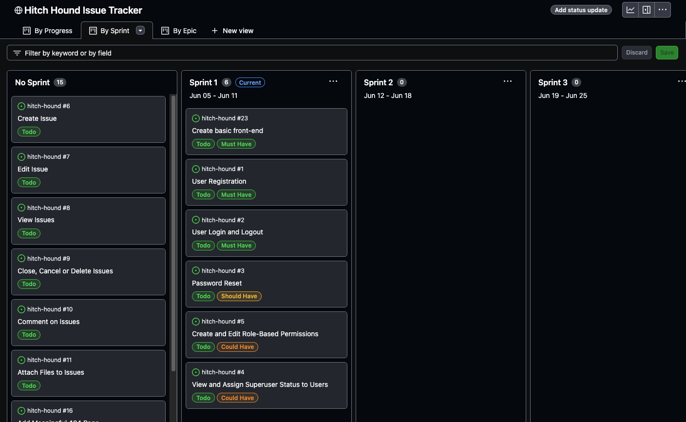

# Hitch Hound: a lightweight issue-tracker

'Hitch Hound' is built using Django, Python, Bootstrap, JavaScript and PostgreSQL. It is hosted on Heroku.
Automated testing is done with Jest (JavaScript) and Unittest (Python).

(Add responsive screenshot here)

# Table of Contents
1. [Purpose](#purpose)
2. [Requirement Gathering and Planning](#requirement-gathering-and-planning)  
    a. [Brief Competitor Analysis and Target Demographic](#brief-competitor-analysis-and-target-demographic)  
    b. [Data and Security features](#data-and-security-features) 
    c. [Epics and User Stories](#epics-and-user-stories)  
    d. [User Journeys](#user-journeys)  
    e. [User Permissions](#user-permissions) 
3. [Data Design](#data)  
    a. [Database Schema](#database-schema)  
    b. [Data Manipulation](#data-manipulation)  
    c. [Data Validation](#data-validation)  
4. [User Interface Design](#user-interface-design)  
    a. [Computer Wireframes](#computer-wireframes) 
    b. [Mobile Wireframes](#mobile-wireframes) 
    c. [Colour Scheme](#colour-scheme)  
    d. [Icons](#icons)  
5. [Testing](#testing)  
    a. [Test Plan](#test-plan)  
    b. [Automated Testing](#automated-testing)  
    c. [Manual Testing](#manual-testing)  
    d. [Browser Compatibility and Screen Size Responsiveness](#browser-compatibility-and-screen-size-responsiveness)  
    e. [Key Responsiveness Differences](#key-responsiveness-differences)  
    f. [Accessibility](#accessibility)  
6. [Bugs](#bugs)
7. [Deployment](#deployment)
8. [Agile Methodology](#agile-methodology)  
    a. [Sprint One](#sprint-one-2705-to-0206)  
    b. [Sprint Two](#sprint-two-0306-to-0906)  
    c. [Sprint Three](#sprint-three-1006-to-1606)  
9. [Credits](#credits)

## Purpose
The objective of this program is to streamline the process of tracking and communicating about issues and bugs arising in software development projects. It is lightweight and intuitive, providing ample functionality for small to medium enterprises who don't need an elevated level of auditing and oversight. 

## Requirement Gathering and Planning

Before starting the coding for this project, I created a detailed plan including my database schema, user journeys and wireframes.

### Brief Competitor Analysis and Target Demographic
When considering competitors in the realm of issue and bug tracking software, it's helpful to look at some well-known options. Atlassian's Jira is widely recognised for its range of features and flexibility, making it a go-to choice for companies of all sizes. Another popular option is GitHub's issue tracking system, which seamlessly integrates with its version control platform, making it a convenient choice for teams already using GitHub. Additionally, tools like Trello are valued for their user-friendly interface and adaptability, though they do lack some of the specific features tailored for issue tracking. In this landscape, my program intends to stand out by focusing on simplicity and ease of use, making it ideal for small to medium enterprises (SMEs) looking for a straightforward solution without unnecessary complexity. The goal is to provide a practical and efficient tool for managing software development issues, offering a simpler alternative in a market dominated by larger, more complex platforms.

### Data and Security Features

With this in mind, the data features chosen are clean and simple. Users can create issues that they associate with a particular project. This allows for a streamlined and intuitive user experience, enhancing productivity and facilitating effective project management. 

The security features cover the essentials: authentication with a username and password, data validation and sanitisation, and keeping track of any changes made with an audit trail.

### Epics and User Stories

My user stories can be seen in full in the associated GitHub Project on my repo. This is where all the details, including tasks and acceptance criteria can be seen. These user stories have been assigned to Epics.

Epic 1: User Management
- Create basic front-end
- User Registration 
- User Login and Logout
- Password Reset
- Create and Edit Role-Based Permissions
- View and Assign Superuser Status to Users

Epic 2: Issue Management 
- Create Issue
- Edit Issue 
- View Issues
- Close, Cancel or Delete Issues 
- Comment on Issues
- Attach Files to Issues

Epic 3: Notifications and Error Messaging
- Add Meaningful 404 Page
- Receive Notifications from Other Users' Actions

Epic 4: Enhanced Issue Management
- Provide a Change History Log
- Connect 2+ Issues as Related
- Search for Issues by Keyword

Epic 5: Project Management
- Create Project
- Edit Project
- Delete Projects

Epic 6: Reporting
- Add Reporting
 
### User Journeys

As a lightweight issue tracking program, my goal was to make each user journey as simple as possible with the fewest steps, whilst still providing value and flexibility of working method. There are ten core user journeys. The below is not an exhaustive list of all possible user journeys, just the most important ones:

1. New User

2. Create an Issue

3. Browse Issues

4. Edit an Issue

5. Close, Cancel or Delete an Issue

6. Create a Project

7. Browse Projects

8. Edit a Project

9. Delete a Project

10. Generate Reports

### User Permissions

There are four types of user, each with different permissions.

| Type | Can create issue? | Can change status to | Can close issue?| Can access admin panel? |
|---|---|---|---|---|
| **Role Based** |
| --> Developer | Yes | In-Progress | No | No |
| --> Quality Assurance | Yes | Testing | No | No |
| --> Product Manager | Yes | Approved |Yes | No |
| **Secondary** |
| --> Superuser | Yes | Any | Yes | Yes |

Each user *must* be assigned a role-based type and *may* also be assigned the superuser type additionally. 

## Data Design

### Database Schema 

The following Entity Relationship Diagram (ERD) illustrates the key entities and relationships in Hitch Hound. It defines the relationships between Issues and all other entities.

### Data Manipulation

Hitch Hound uses CRUD principles to guide all data manipulation. 

#### Issues
- Create: report a new issue, filling in all mandatory fields.
- Read: retrieve an issue by project, issues page, reports or user profile.
- Update: edit an issue's fields or add a new comment. 
- Delete: delete an issue.

#### Projects
- Create: start a new project, filling in the title. 
- Read: retrieve a project via the projects page.
- Update: change the title of a project. 
 
- Deletion of 'Projects is not allowed in order to retain accurate records and protect data integrity.

#### Other Data

- The 'Change' entity type is a type of metadata created after an 'Issue' entity is updated in any way. It is not possible to update or delete a 'Change' entity.
- The 'Comment' entity type is simply one of the updates to the 'Issue' entity type.

### Data Validation

The following data validation rules ensure the accuracy and reliability of information stored in the system, ensuring all entries adhere to expected formats.

#### Users
- userID: Must be a unique integer
- firstName: Must be non-empty string 
- lastName: Must be non-empty string
- emailAddress: Must be a valid email format and unique within the system
- password: Must meet complexity requirements (e.g., minimum length, inclusion of special characters)
- role: Must be one of the predefined roles (developer, quality assurance or product manager)
- superuser: Must be a boolean value

#### Projects
- title: Must be a unique, non-empty string

#### Issues
- issueID: Must be a unique integer
- title: Must be a non-empty string
- description: Must be a string, can be empty
- severity: Must be one of the predefined levels (4-low, 3-medium, 2-high, 1-critical)
- project: Must reference a valid project title
- type: Must be one of the predefined types (bug, missed requirement or other issue)
- status: Must be one of the predefined statuses (open, in progress, testing, approved, closed or cancelled)
- reporter: Must reference valid userID
- developer: Must reference valid userID
- qualityAssurance: Must reference valid userID
- productManager: Must reference valid userID

#### Comments
- commentID: Must be a unique integer
- commentText: Must be a non-empty string
- userID: Must reference a valid userID
- issueID: Must reference a valid issueID
- commentTimestamp: Must be a valid timestamp

#### Changes
- changeID: Must be a unique integer
- issueID: Must reference a valid issueID
- userID: Must reference a valid userID
- changeTimestamp: Must be a valid timestamp
- fieldChanged: Must be one of the predefined types (all 'Issue' attributes apart from IssueID).
- oldValue: Must be a string, can be empty.
- newValue: Must be a string, can be empty.

## User Interface Design

### Computer Wireframes

The wireframes I created illustrate the core user interface and functionality of Hitch Hound from both a desktop/laptop perspective and a mobile/tablet perspective. These visual guides serve as a blueprint for the design and structure of the application, ensuring a cohesive and intuitive user experience. 

#### Home: Sign Up

#### Home: Log In

#### Home: Logged In

#### Individual Issue

#### Issue Change History

#### New Issue

#### Projects

#### Individual Project

#### New Project

#### Edit Project

#### Reports

#### User Profile

#### Notification Modal

#### 404 Page

### Mobile Wireframes

| Sign Up | Log In |
|---|---|
| |  |

| All Issues | Individual Issue  |
|---|---|
|| |

|Issue Change History| New Issue |
|---|---|
| |  |

| Projects | Individual Projects |
|---|---|
| |  |

| New Project | Edit Project |
|---|---|
| |  |

| Reports |
|---|
|  | 

| User Profile | Notifications |
|---|---|
||  |

| 404 Page |
|---|
|  |

### Colour Scheme 

I wanted to pick a muted palette to reflect the business nature of my program. I chose my base colour and then selected two lighter shades to implement as a gradient. I then desaturated my base colour by 90% to find a complementary charcoal grey. Finally, I lightened my colour by 95% to find a complementary cream colour. 

### Icons

As I had chosen the name 'Hitch Hound' for my program, I thought it would provide visual interest and be a fun twist, to include dog imagery in my logo and icons.

#### Logo

This dog in a shield was perfect for my logo:  

#### Other

There were also a few other options for use throughout the program:  

## Testing

### Test Plan

**Continuous Testing**
I developed this program using the 'red, green, refactor' approach

Through a combination of automated testing written using Jest for JavaScript and Unittest for Python, and manual testing from the front-end, I achieved a good coverage of test cases. The code I wrote was also passed through validators/linters at the end to ensure adherance to coding standards and best practices, ultimately aiming for robust and maintainable code.

### Automated Testing

Jest Testing:

Unittest Testing:

### Manual Testing

My manual testing covered: 

- Each user journey from end to end
- The level of access when logged out 
- The level of access when logged in as a regular user
- The level of access when logged in as a superuser

### Browser Compatibility and Screen Size Responsiveness

I viewed the program on each of the three key screen sizes (mobile, tablet and computer), using devtools, on four of the most popular browsers. I also used the responsive setting to slide the width of the screen from narrow all the way through to wide to check the transition points. 

Pixel references for each of the screen sizes:

|Screen | Pixels |
|-----|-----|
| Mobile - iPhone SE | 375px |
| Tablet - iPad Mini | 768px |
| Computer | 1366px |

| Browser | Screen Size | Appearance | Responsiveness |
|-------|-----|-----|-----|
| Chrome | Mobile |   | |
| | Tablet |  |  |
| | Computer |  |  |
| | Transition Points |  |  |
| Firefox | Mobile |  |  |
| | Tablet |  |  |
| | Computer |  |  |
| | Transition Points |  |  |
| Safari | Mobile |   |   |
| | Tablet | |   |
| | Computer |   |  |
| | Transition Points | |  |
| Edge | Mobile |  |  |
| | Tablet |  |  |
| | Computer |  |  |
| | Transition Points |  |  |

#### Key Responsiveness Differences

The 

### Code Validation

| Language | Validation Method | Outcome |
|---|----|----|
| HTML | [W3C HTML Validator](https://validator.w3.org/) | X errors. All resolved.|
| CSS | [W3C CSS Validator](https://jigsaw.w3.org/css-validator/) | X errors. All resolved. |
| JavaScript | [JS Hint](https://jshint.com/) | X errors. All resolved.  |
| Python | [PEP8 Code Institute Python Linter](https://pep8ci.herokuapp.com/) | X errors. All resolved. |

### Accessibility 

**Lighthouse**
To ensure the front end of my program was accessible I used Lighthouse. 

Here are the results: 
(screenshot)

**Colour Contrast**
I also checked the colour contrast using of my color palette combinations using [Coolors](https://coolors.co/contrast-checker/112a46-acc8e5.)

**Alternative Text**
I ensured I had set alternative text for the only image on my site: the logo. 

## Bugs

Here is the list of bugs found towards the end of development when I encountered functionality not working as intended that I had previously thought did. I don't believe I have left any unresolved bugs. 

### Bug One

#### Issue

#### Solution

## Deployment
This project was deployed to [Heroku](https://id.heroku.com/login): a hosting platform. 

These are the steps I took to set up my infrastructure and deploy my app:
1.
2.
3.
4.
5.
6.
7.
8. I created a new repository on my GitHub from the [Code Institute template](https://github.com/Code-Institute-Org/p3-template) and named it 'hitch-hound'
9. I opened this repo on my IDE and
10. 
11.
12. Next I clicked on the 'Deploy' tab and connected my github repository code to the Heroku app. I clicked 'Enable Automatic Deploys' and Heroku deployed the app for me. Once this was done, the link to the app appeared and could be clicked to go to the deployed app.

## Agile Methodology
I set this project up in GitHub projects using agile methodology. This facilitated my prioritisation and time management. I added all the user stories as issues and then divided them into 'MVP'(Minimum Viable Product) and 'Future Enhancements' to signify what I intend to complete for my assessed project and what could come later. Those MVP stories were then stack-ranked. I added three one-week sprints to the project and filled my first sprint with my intended work according to the MoSCoW prioritisation system. 

### Sprint One: 05/06 to 11/06

#### Sprint Planning
Sprint planning involved taking the highest priority issues from the top of the stack and assigning them to the first sprint. I marked the first three as 'Must Have' for this sprint, the next one 'Should Have' and the last two 'Could Have'. This gave me a breakdown of 50% for must, 16.6% for should and 33.4% for could. If I achieve all of these user stories in the first sprint, I will have completed my first epic: User Management.

#### Sprint Retrospective

Sprint Overview: 
During my initial one-week sprint, I completed the user story for 'Create basic front-end'. This task involved laying much of the foundational work for my project.

Achievements: 
- Successfully created the basic front-end.
- Established the groundwork for future development.

Progress:
- Began working on 'User Registration' user story
- Completed the setup of the database schema and models
- Integrated the database with the project

Challenges: 
- Time constraints were more significant than anticipated, affecting my ability to complete all planned tasks

Action Items for Next Sprint: 
- Improve time estimation, including buffer time for unforeseen challenges
- Aim to complete the first epic

### Sprint Two: 12/06 to 18/06

#### Sprint Planning
For the second sprint, I carried over the same stories I had planned for the first sprint but not finished. I did not include any more because experience has shown me that I am unlikely to get all these stories finished. Therefore only 40% of the stories are must have, 20% should have and 40% could have. With more time this sprint, I should be able to complete the must have stories at a minimum. 

#### Sprint Retrospective
Achievements: 
- Successfully created the user registration, login and logout.

Progress:
- Began working on 'Password Reset' user story
- Continued learning about Django and how to set up different elements

Challenges: 
- Configuration was not as straightforward as I hoped, so there were a couple of times it felt like 2 steps forward, 1 step back. 

Action Items for Next Sprint: 
- Complete the first epic. Just half a user story left.
- Make a good dent in Epic 2: Issue Management.

### Sprint Three: 19/06 to 25/06

#### Sprint Planning
For the third sprint, I carried over one story and put back another story, towards the bottom of the backlog as I realised I would not be able to sort out all the permissions until I had the bulk of the reset of the development complete. 50% of my stories for sprint 3 are must have, 25% should have and 25% could have. If I manage to complete these, I can always pull in some more stories. 

#### Sprint Retrospective

### Future Development
Likely to be, at a minimum:
- Connect 2+ Issues as Related
- Search for Issues by Keyword

## Credits

### APIs and Third Party Libraries

### Sources
I referred back to the Code Institute set up videos to remind me how to set up the APIs, credentials and files before starting coding.

- I built my flowcharts using [Mermaid](https://mermaid.js.org/syntax/flowchart.html) in my readme.
- I manipulated my base colour to figure out my colour palette using [MDigi Tools](https://mdigi.tools/desaturate-color/#508072).
- I visually represented my colour palette using [Adobe Colour](https://color.adobe.com/create/color-wheel).
- I sourced my icons from [Font Awesome](https://fontawesome.com/search?q=dog&o=r&m=free)
- I created all my favicons with [Real Favicon Generator](https://realfavicongenerator.net/)
- I used [Chat GPT](https://chatgpt.com) to explain error messages and research the best way to go about my implementation.
- I used [Learn Django](https://learndjango.com/tutorials/django-login-and-logout-tutorial) to help me set up login/logout etc.

I also used the documentation of all the elements included in this project: 
- [Django](https://docs.djangoproject.com/en/4.2/)
- [Bootstrap](https://getbootstrap.com/docs/4.1/getting-started/introduction/)
- [PostgreSQL](https://www.postgresql.org/docs/current/)

### General Credit
As ever, I want to thank the open source community for the great resources that teach me so much and also remind me of what I learnt in my Code Institute lessons. 

I believe I have specifically credited where I used specific items in the previous section but this is a general credit to the reference resources I looked through to teach me new elements as well as reminding me how things I'd already come across worked as I went along. 

Every effort has been made to credit everything used, but if I find anything else specific later on that needs crediting, that I missed, I will be sure to add it.